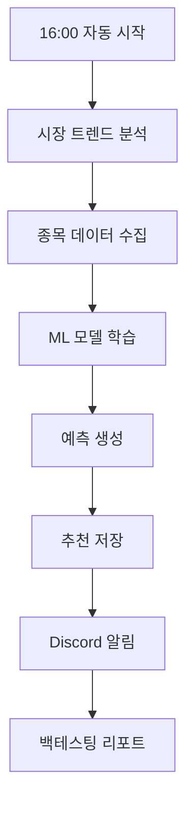

# 🚀 Quick Start Guide

## 즉시 실행하기

### 1️⃣ 시스템 상태 확인
```bash
./scripts/run.sh status
```

### 2️⃣ 즉시 ML 분석 실행
```bash
./scripts/run.sh analyze
```

### 3️⃣ 백테스팅 (최근 30일)
```bash
./scripts/run.sh backtest 30
```

### 4️⃣ 자동화 시스템 시작
```bash
./scripts/run.sh schedule
```

## 📁 정리된 프로젝트 구조

```
stock-analyzer/
├── 📂 app/                          # 핵심 애플리케이션 코드
│   ├── config/                      # 설정 관리
│   ├── database/                    # DB 연결 및 Redis
│   ├── models/                      # SQLAlchemy 엔티티
│   ├── services/                    # 비즈니스 로직
│   └── utils/                       # 유틸리티
├── 📂 scripts/                      # 운영 스크립트
│   ├── 🤖 production_ml_system.py   # 메인 ML 예측 시스템
│   ├── 📅 daily_trading_system.py   # 일일 자동화 스케줄러
│   ├── 📊 backtesting_system.py     # 백테스팅 시스템
│   ├── 📥 collect_enhanced_data.py  # 데이터 수집
│   ├── 🎮 run.sh                    # 통합 실행 스크립트
│   └── deployment/                  # 배포 관련 파일
├── 📂 database/migrations/          # 데이터베이스 마이그레이션
├── 📂 storage/                      # 데이터 저장소
│   ├── logs/                        # 로그 파일
│   ├── models/                      # ML 모델 파일
│   └── data/                        # 임시 데이터
├── 📂 docs/                         # 문서
└── 📂 tests/                        # 테스트 코드
```

## 🎯 주요 스크립트 기능

| 스크립트 | 기능 | 실행 주기 |
|---------|------|----------|
| `production_ml_system.py` | ML 분석 및 예측 | 수동/자동 |
| `daily_trading_system.py` | 자동화 스케줄러 | 평일 16:00, 토요일 09:00 |
| `backtesting_system.py` | 과거 성과 분석 | 수동 |
| `collect_enhanced_data.py` | 데이터 수집 | 자동화에 포함 |

## ⚙️ 시스템 설정

### 환경 변수 (.env)
```bash
cp .env.example .env
# .env 파일을 편집하여 API 키 설정
```

### 필수 서비스
- ✅ PostgreSQL (데이터베이스)
- ✅ Redis (캐싱)
- ✅ KIS API 키 (한국투자증권)
- ✅ Discord Webhook (알림)

## 🔄 일일 운영 플로우



## 📱 알림 예시

```
🚀 운영환경 ML 주식 추천 시스템

📅 분석 시간: 2025-09-22 16:00:00
🎯 모델 정확도: 0.668 (bull_market)
📊 학습 샘플: 630개

📈 시장 현황: ➡️ 중립장 🟡
📊 시장 트렌드: +0.12%

🏆 오늘의 TOP 5 추천:

📈 1. 005930 (삼성전자)
   💰 현재가: 71,200원
   🎯 예상수익률: +2.1%
   🤖 ML점수: 0.839
   📋 이유: RSI 과매도(28.5), 볼린저밴드 하단
```

## 🛠️ 유지보수

### 로그 확인
```bash
./scripts/run.sh logs
```

### 시스템 상태
```bash
./scripts/run.sh status
```

### 데이터 수집
```bash
./scripts/run.sh collect
```

## 📈 성과 지표

- **모델 정확도**: 66.8%
- **일일 자동 실행**: ✅
- **Redis TTL 관리**: ✅ (23.5시간)
- **오류 자동 복구**: ✅
- **백테스팅**: ✅

---

**🎉 이제 완전히 자동화된 AI 주식 추천 시스템이 준비되었습니다!**

매일 오후 4시에 자동으로 분석하고 Discord로 결과를 알려줍니다. 🚀
